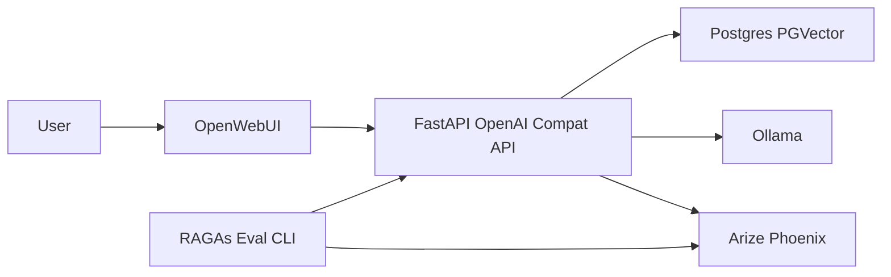

# Agentic RAG Build Plan

## Confirmed decisions
- Runtime: Python 3.11
- Provider strategy: both OpenAI and Ollama are supported from day one
- Default provider: OpenAI via environment configuration

## System design

## Scope and execution order
1. Create full repository skeleton and service boundaries.
2. Stand up infrastructure with Docker Compose and env wiring.
3. Implement FastAPI configuration with provider toggles and strict validation.
4. Build OpenAI-compatible endpoints for models and chat completions.
5. Add streaming response support with OpenAI-compatible SSE framing.
6. Implement ingestion endpoints and Docling extraction pipeline.
7. Implement chunking metadata contract and persistence.
8. Implement LlamaIndex plus PGVector indexing with pluggable embeddings.
9. Implement retriever tool contract with contexts and citations.
10. Wire baseline RAG in chat path with grounded citations.
11. Add CrewAI planner, retriever, answerer workflow.
12. Instrument ingestion, retrieval, generation, and crew spans in Phoenix.
13. Build RAGAs console evaluation app and reports.
14. Finalize operational docs and end-to-end smoke test procedure.

## Done criteria
- OpenWebUI can chat through FastAPI using OpenAI-compatible routes.
- PDF ingestion produces searchable chunks with stable citation metadata.
- Retrieval grounded answers include source references.
- Phoenix shows trace visibility for key pipeline stages.
- RAGAs CLI produces repeatable metrics output.
